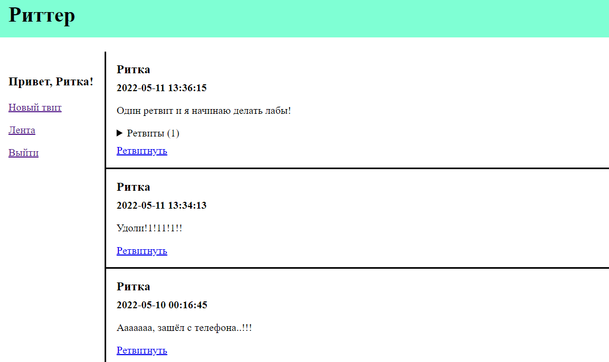
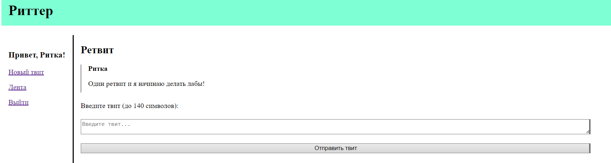

# Отчет по практической работе
#### Дисциплина: Облачные вычисления
#### Выполнил: Сеннов Владимир, гр. 3530201/80101

## Постановка задачи
В рамках работы необходимо разработать сервис "Мини-твиттер": сервис, 
который принимает твиты и сохраняет их в базе данных. По другому вызову API 
сервис выводит ленту твитов.

Сервис необходимо развернуть на облачном сервисе, создав необходимую 
инфраструктуру. После этого необходимо продемонстрировать результат работы.

## Ход работы 
### Проектирование интерфейса
Сервис будет иметь web-интерфейс. Пользователь должен иметь возможность делать следующие действия: 
* авторизация и выход из аккаунта;
* просмотр ленты твитов;
* добавление нового твита.

Для этих действий были созданы 4 страницы:
1. **Страница авторизации**: пользователю предлагается ввести логин и пароль для авторизации. При введении правильных данных пользователь попадает на страницу ленты твитов. При введении неправильных данных пользователь переходит на эту же страницу, видя тип ошибки: неверное имя пользователя или неверный пароль.
2. **Страница ленты твитов**: пользователь видит навигационную панель и ленту. В навигационной панели отображается приветствие пользователя и ссылки на остальные страницы сайта: эту страницу, страницу создания нового твита и страницу выхода. В ленте отображаются твиты. Каждый твит содержит имя пользователя, который его отправил, время отправки, текст твита, и ретвиты (если они есть). Также каждый твит содержит ссылку на страницу создания нового твита для ретвита этого твита. Все твиты в ленте упорядочены от самый новых к самым старым. Ретвиты отображаются скрытым списком с указанием их количества. Каждый ретвит содержит имя автора, время публикации и текст. Ретвиты в списке упорядочены от самых старых к самым новым.
3. **Страница добавления твита**: пользователь видит навигационную панель и форму создания твита. Навигационная панель такая же как у страницы ленты твитов. Форма создания твита имеет кнопку отправки и одно поле: текст твита. В заголовке формы указывается, создается новый твит или ретвит. Если создается ретвит, отображается твит, который ретвитится. 
4. **Страница выхода**: пользователю отображается информация о выходе и ссылка на страницу авторизации.

### База данных
В данной работе была использована база данных MySQL 8.0.
#### Схема базы данных
Для данного сервиса необходима простая база данных, состоящая из двух таблиц: "Пользователь" и "Твит". 

В таблице "Пользователь" необходимы следующие поля: 
1. Id пользователя.
2. Имя пользователя.
3. Хэш пароля.

В таблице "Твит" содержатся следующие поля:
1. Id твита.
2. Id пользователя, который создал твит.
3. Время публикации.
4. Текст твита.
5. Id твита, для которого этот твит является ретвитом. Может быть NULL. 

SQL код для создания базы данных приведен в файле [sql/creation.sql](https://github.com/Vovan-S/Cloud-Practics-Ritter/blob/master/sql/creation.sql).

#### Запросы к базе
К базе данных необходимы следующие запросы:
* Добавление нового пользователя. В этой версии делается администраторами сайта.
* Проверка наличия пользователя.
* Проверка совпадения данных пользователя.
* Вывод ленты твитов и ретвитов согласно описанию. Запрос представлен реализован следующим образом: выводится множество картежей (твит, ретвит). Если у твита несколько ретвитов, то таких картежей будет по количеству ретвитов, причем твит будет повторяться. Если у твита нет ретвитов, то ретвит будет нулевым. Реализация запроса представлена в файле [sql/queries.sql](https://github.com/Vovan-S/Cloud-Practics-Ritter/blob/master/sql/queries.sql). 
* Добавление нового твита. 

Все запросы хранятся в файле [python/resources.py](https://github.com/Vovan-S/Cloud-Practics-Ritter/blob/master/python/resources.py).

### Frontend
Web-страницы реализованы при помощи чистого HTML и CSS.

HTML контент генерируется динамически на основе шаблонов. Шаблоны хранятся в файле [python/resources.py](https://github.com/Vovan-S/Cloud-Practics-Ritter/blob/master/python/resources.py).

Стили CSS хранятся в виде статического файла [static/web.css](https://github.com/Vovan-S/Cloud-Practics-Ritter/blob/master/static/web.css).

### Backend
Сервер реализован на языке Python 3.8 с использованием стандартной библиотеки [http.server](https://docs.python.org/3/library/http.server.html). 

Для подключения к базе используется [Connector/Python для MySQL](https://dev.mysql.com/doc/connector-python/en/connector-python-introduction.html). Данные для входа в базу данных находятся в файле [enviroment](https://github.com/Vovan-S/Cloud-Practics-Ritter/blob/master/enviroment).

Для хэширования паролей используется sha512 из [hashlib](https://docs.python.org/3/library/hashlib.html). Перед хэшированием пароли солятся глобальной солью, которая задается в файле enviroment. 

Для системы авторизации используются cookie-файлы. 

Логика работы сервера реализована в модуле [python/server.py](https://github.com/Vovan-S/Cloud-Practics-Ritter/blob/master/python/server.py).

Для запуска сервера в режиме демона используется модуль [python/serverd.py](https://github.com/Vovan-S/Cloud-Practics-Ritter/blob/master/python/serverd.py). Для запуска сделан скрипт [start_server.sh](https://github.com/Vovan-S/Cloud-Practics-Ritter/blob/master/start_server.sh).

Сервер открывается на порте 80, для этого запускать его с помощью sudo. Порт можно изменить в файле [python/setting.py](https://github.com/Vovan-S/Cloud-Practics-Ritter/blob/master/python/settings.py).

### HTTP интерфейс
Доступны следующие интерфейсы: 
* **GET /login** выводит страницу авторизации
* **POST /login** отправляется данные пользователя. В данной версии пароль отправляется в открытом виде. На стороне сервера происходит проверка данных. Если они верные по отправляется страница с перенаправлением на **/feed**. На стороне сервера авторизованному пользователю генерируется UUID, который хранится на сервере и отправляется пользователю с помощью cookie. Если данные не верные, оправляется страница авторизации с указанной ошибкой.
* **GET /feed** если пользователь прикрепляет валидный UUID в cookie, ему выводится страница ленты. Иначе ему оправляется ответ 307 с перенаправлением на страницу **/login**.
* **GET /new** если пользователь прикрепляет валидный UUID в cookie, ему выводится страница создания нового твита. Иначе ему оправляется ответ 307 с перенаправлением на страницу **/login**.
* **GET /new/*id*** если пользователь прикрепляет валидный UUID в cookie, то проверяется, существует ли твит с указанным *id*. Если он существует то выводится страница создания ретвита с данным твитом, иначе отправляется ошибка 404. Если пользователь не прикрепляет валидный UUID, то ему отправляется ответ 307 с перенаправлением на страницу **/login**.
* **POST /new** если пользователь прикрепляет валидный UUID в cookie, то создается твит с id этого пользователя, введенным текстом и текущем временем на сервере, retweet_id = NULL. Пользователь получает перенаправление на **/feed**. Иначе пользователю отправляется ошибка 401 Unauthorized.
* **POST /new/*id*** если пользователь прикрепляет валидный UUID в cookie, то проверяется, существует ли твит с этим *id*. Если он есть, то создается твит с id этого пользователя, введенным текстом и текущем временем на сервере, если retweet_id указанного твита равен NULL, то retweet_id нового твита устанавливает tweet_id этого твита. Если retweet_id указанного твита не равен NULL, то retweet_id нового твита устанавливается равным retweet_id этого твита. Если пользователь не прикрепляет валидный UUID, ему отправляется ошибка 401 Unauthorized.
* **GET /logout** если пользователь прикрепляет валидный UUID в cookie, то этот UUID удаляется на сервере и пользователю выводится страница с сообщением о выходе. 
Иначе ему оправляется ответ 307 с перенаправлением на страницу **/login**.

### Создание облачной инфраструктуры
Для работы было выбрано облако [Yandex Cloud](https://cloud.yandex.ru). 

Для работы с облаком был создан платежный аккаунт и активирован пробный период. При помощи веб интерфейса было создано облако и группа в нем. 

Для описания инфраструктуры использовался Terraform. Программа была скачена с зеркала Яндекса. При помощи конфигурации Terraform были созданы следующие ресурсы: 
* сеть в зоне доступности ru-central-b;
* подсеть в этой сети;
* виртуальная машина в этой подсети;
* группа безопасности с возможностью подключения по порту 3306 для MySQL;
* кластер MySQL в этой подсети с этой группой безопасности.

Описание инфраструктуры представлено в файле [tf/yandex.tf](//github.com/Vovan-S/Cloud-Practics-Ritter/blob/master/tf/yandex.tf). К этому файлу должен быть подключен файл tf/user-data.txt, в котором в формате cloud-config описаны данные пользователя для подключения к виртуальной машине по ssh. Для использования конфигурации Terraform нужно задать переменные с данными пользователя. Файл с переменными и файл user-data.txt отсутствуют в репозитории.

Данные для подключения к виртуальной машине были выведены при помощи output variables в Terraform. Данные для подключения к базе данных можно посмотреть в веб-интерфейсе облака или с помощь CLI.

    yc managed-mysql host list --cluster-name="<имя базы>"

### Настройка инфраструктуры
К сожалению, инструмент Ansible для развертки не был использован, поскольку он не работает на Windows. Развертка была произведена вручную. 

Для развертки необходимы следующие шаги: 
1. Подключение к виртуальной машине по SSH.
2. Установка следующих пакетов:

        sudo apt install git
        sudo apt install mysql
        sudo apt install pip
        sudo pip install mysql-connector-python
3. Скачивание этого репозитория:

        git clone https://github.com/Vovan-S/Cloud-Practics-Ritter ritter
4. Получение сертификата безопасности: 

        mkdir ~/.mysql
        wget "https://storage.yandexcloud.net/cloud-certs/CA.pem" -O ~/.mysql/root.crt
        chmod 0600 ~/.mysql/root.crt
5. Подключение к базе данных:

        mysql --host=<hostname> \
	    --port=3306 --ssl-ca=~/.mysql/root.crt \
	    --ssl-mode=VERIFY_IDENTITY --user=<username>\ 
        --password Ritter

6. Создаем базу и выходим:
        
        SOURCE ritter/sql/creation.sql
        exit

7. Заполняем файл enviroment в репозитории необходимыми значениями.

8. Запускаем сервер:

        cd ritter
        sudo ./start-server.sh

9. Проверяем по логам, что все хорошо, после этого выходим.

После выполнения этих операций по адресу виртуальной машины можно будет подключиться по 80 порту.

## Результат работы программы
На момент написания отчета, сервис доступен по этому [адресу](http://51.250.100.70), и будет доступен, пока не закончится пробный период на облаке. Зайти на сервис можно с этими данными: 
* **Логин**: Вова
* **Пароль**: Вован

Поскольку сайт работает на самых дешевых настройках, отвечать он может долго.

Ниже представлены скриншоты страниц сайта.

Страница авторизации:

Лента твитов:

Новый твит (ретвит): 

Страница выхода:

## Заключение 
В рамках работы был разработан с нуля сервис "Мини-твиттер". Была спроектирован пользовательский интерфейс, разработана схема базы данных, был реализован frontend при помощи чистых HTML и CSS, backend был написан на языке Python 3.8. В качестве базы данных использовался MySQL 8.0, сервер был написан с использованием стандартной библиотеки http.server.

Сервис был развернут на облачном сервере Yandex Cloud. Для создания инфраструктуры использовался Terraform, настройка инфраструктуры производилась вручную.

Сервис был запущен и в данный момент доступен по адресу 51.250.100.70.